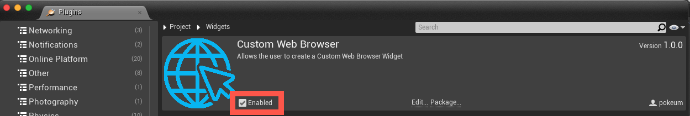

# Custom Web Browser

Created a `Custom Web Browser` plugin by extending the `Web Browser Widget` provided by Unreal Engine.

## Integrating the Plugin

1. Copy [`demo/Shared/Plugins/CustomWebBrowser`](demo/Shared/Plugins/CustomWebBrowser) into your own app's Plugin folder.

2. Copy the `CustomWebBrowser` folder into it. You should have something like:
   
   ```
   MyProject
      ├── Plugins
            └── CustomWebBrowser
                  └── CustomWebBrowser.uplugin
   ```

3. If using a C++ Project, configure your module to reference the CustomWebBrowser module. In your *.Build.cs file, add **"CustomWebBrowser"** to your PublicDependencyModuleNames. Ex:
   
    ```csharp
    PublicDependencyModuleNames.AddRange(new string[] { ... , "CustomWebBrowser" });
    ```

4. In a Blueprint Project, enable the plugin by first clicking **Settings** > **Plugins**, scrolling down to Project section of plugins, and clicking **Widgets** > **Custom Web Browser**. From there you can tick the Enabled checkbox:

    |  |
    | -- |


## Messaging System

### Send and Receive

You can send a message from the web view to `CustomWebBrowser`. It helps you implement a way to "control" your game from the web page.

By binding **HandleOnBeforeBrowse** method to the OnBeforeNavigation event, using an FOnBeforeBrowse delegate, Custom Web Browser inspects all links starts from `uewebbrowser://` by default. That means if your user taps a link starting with "uewebbrowser://", an OnMessageReceived event will be raised with the remainder of the URL after the scheme as its parameter.

If you have this on your page:
```html
<a href="uewebbrowser://action?key=value&anotherKey=anotherValue">Tap Me</a>
```

And you have this event listener in Unreal Engine:

> - Header File (.h)
>   ```hpp
>   #pragma once
>   
>   #include "Blueprint/UserWidget.h"
>   #include "WebViewWidget.generated.h"
>     
>   class UCustomWebBrowser;
>
>   UCLASS()
>   class DEMO_API UMainMenuWidget : public UUserWidget
>   {
>      GENERATED_BODY()
>
>   ...
>   
>   protected:
>      UPROPERTY(BlueprintReadWrite, meta = (BindWidget))
>      UCustomWebBrowser* CustomWebBrowser;
>   
>   private:
>      UFUNCTION()
>      void OnMessageReceived(FString Message);
>   };
>   ```
> - Source File (.cpp)
>   ```cpp
>   #include "Widget/CustomWebBrowser.h"
>   
>   if (CustomWebBrowser != nullptr)
>   {
>      CustomWebBrowser->OnMessageReceived.AddDynamic(this, &UMainMenuWidget::OnMessageReceived);
>   }
>   
>   void UMainMenuWidget::OnMessageReceived(FString Message)
>   {
>      UE_LOG(LogTemp, Warning, TEXT("%s"), *Message);
>   }
>   ```

When the link is tapped, it prints:
```
action?key=value&anotherKey=anotherValue
```

> [!TIP]
> **NAVIGATION**<br/>
> 
> Besides of an HTML link, a `location.href` JavaScript will also send a message to CustomWebBrowser and trigger the event.
> The code below is identical to example above:
> ```js
> location.href = "uewebbrowser://action?key=value&anotherKey=anotherValue";
> ```

### SWebBrowser::BindUObject

By using [`SWebBrowser::BindUObject`](https://dev.epicgames.com/documentation/en-us/unreal-engine/API/Runtime/WebBrowser/SWebBrowser/BindUObject),
the CustomWebBrowser instance is exposed to the browser runtime, enabling JavaScript in the page to directly invoke methods on the C++ side.

For example, the following JavaScript snippet produces the same result as the code shown above.
```js
window.ue.uewebbrowser.sendmessage("action?key=value&anotherKey=anotherValue")
```

## Reference

https://docs.uniwebview.com/guide/messaging-system.html
